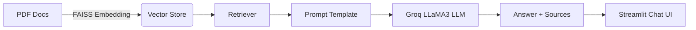

# Confluence RAG Chatbot

A production-ready, AI-powered chatbot that answers user questions by intelligently retrieving and summarizing content from **Confluence documentation**. Designed using **LangChain**, **FAISS**, **Groq LLMs (LLaMA 3)**, and **Streamlit**, this solution brings **context-aware, source-backed answers** to your team in real time.

---

## What Is This?

Confluence documentation is often dense and scattered. This chatbot uses **Retrieval-Augmented Generation (RAG)** to bridge that gap:

- Vectorizes Confluence PDFs using FAISS
- Answers questions using Groq's blazing-fast LLaMA 3 model
- Cites source documents (when relevant)
- Returns fallback responses when no match is found

> This isn't just a search — it's a smart assistant that *understands* what you're asking and *why*.

---

## Use Cases

- Instant internal documentation support for new hires or developers
- Automated helpdesk for teams using Confluence
- Embeddable AI FAQ bot for internal tools or customer portals

---

## Features

| Feature                     | Description                                                                 |
|-----------------------------|-----------------------------------------------------------------------------|
|    PDF-to-Vector Conversion |  All Confluence PDFs are converted to embeddings using FAISS                |
|    LLM Answer Engine        |  Answers generated using Groq-hosted LLaMA 3 8B models                      |
|    Chat UI with Memory      |  Chat history retained across messages using Streamlit                      |
|    Similarity Scoring       |  Only returns answers when a match is confident (via score threshold)       |
|    Source-Aware Replies     |  Shows source doc links only when relevant                                  |
|    Secure API Access        |  Uses `.env` to store and manage secrets                                    |

---

##  Architecture Overview

---

- Embedding: Your PDFs are chunked and embedded into a FAISS vector store.
- Querying: Each user query is compared against the vector store.
- LLM: The most relevant documents are passed to the LLM with a custom prompt.
- Response: The chatbot answers the question and cites sources.

---
## Confluence Chatbot 

